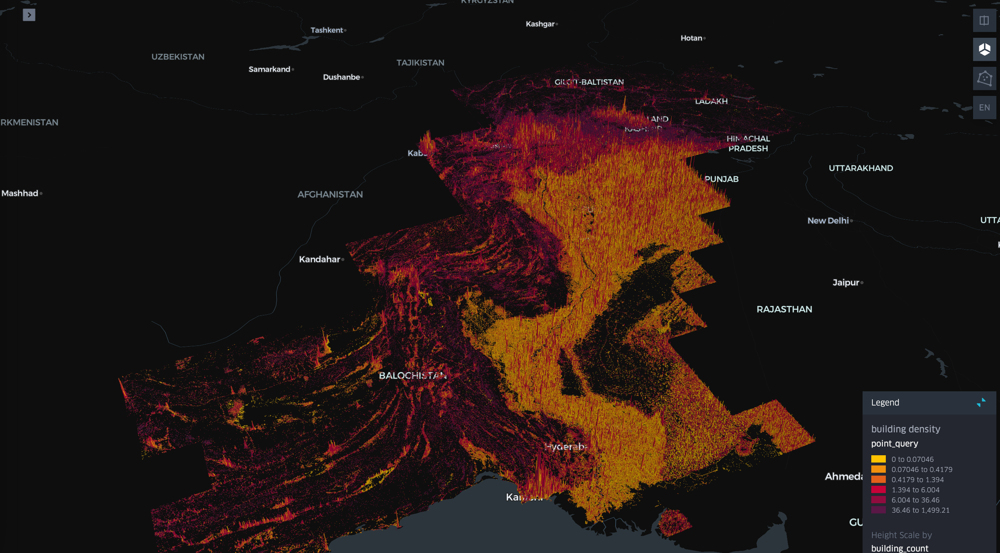
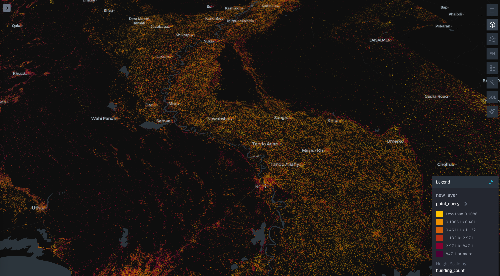

# pakistan_floods
Check out the related [LinkedIn post](https://www.linkedin.com/posts/smarzban_pakistan-is-in-the-middle-of-its-worst-flooding-activity-7368008542806495236-nCDp) for more context.

## Changelog

- Updated from point query to zonal stats — averaged data over an H3 cell for smoother, improved visualization.


## Upper Indus river system


## Sindh


## License
- Code files: [MIT] — MIT License.

## Citation

If you use this repository, please cite it as follows:

```bibtex
@misc{pakistan_floods,
    author = {Shabbir Marzban},
    title = {pakistan_floods},
    year = {2025},
    howpublished = {\url{https://github.com/ShabbirMarzban-TomTom/pakistan_floods}},
}
```
